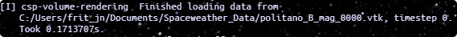
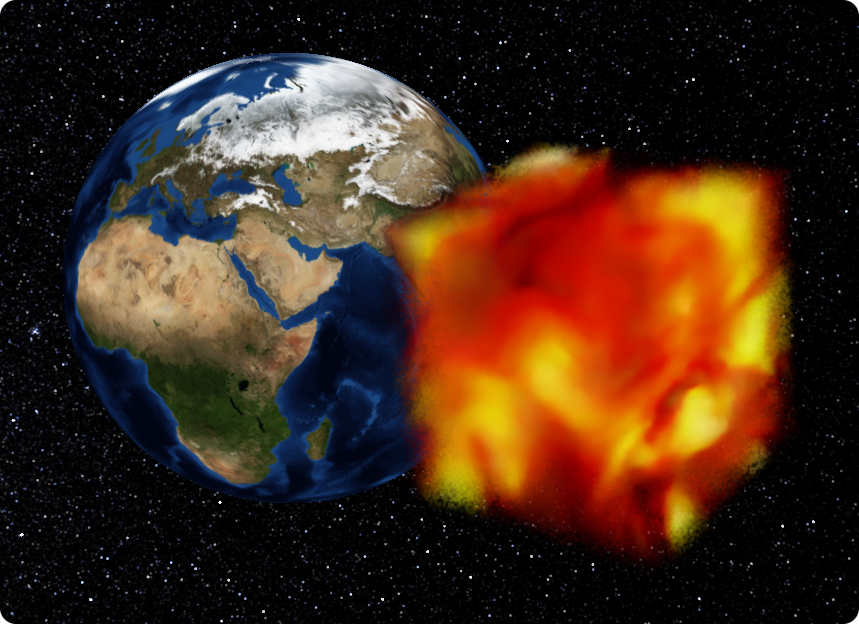
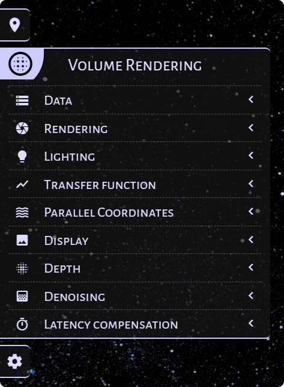
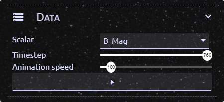
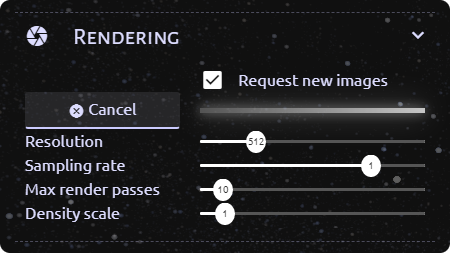
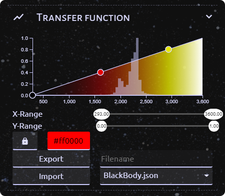
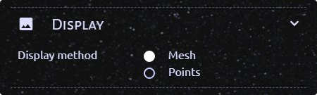
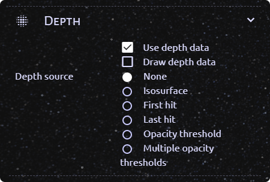
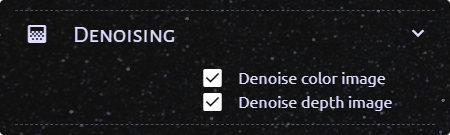
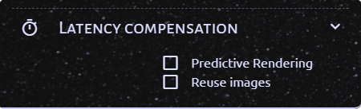

# Volume rendering for CosmoScout VR

A CosmoScout VR plugin which allows rendering of volumetric datasets.

## Configuration

This plugin can be enabled with a configuration using the following pattern in your `settings.json`:

```javascript
{
    ...
    "plugins": {
        ...
        "csp-volume-rendering": {
            "volumeDataPath": <path to directory containing simulation data>,
            "volumeDataPattern": <regex pattern that matches simulation filenames>,
            "volumeDataType": "vtk",
            "volumeStructure": <"structured"/"unstructured">,
            "volumeShape": <"cubic"/"spherical">,
            "anchor": <Anchor name, e.g. "Earth">
        }
    }
}
```

The following example settings can be used, if

* Your data is saved in the directory `/path/to/data/`
* The filenames of individual simulation steps follow the pattern `simulation_0.vtk`, `simulation_1.vtk`, `simulation_2.vtk` etc. where `0`, `1`, `2` are indices for the steps
* Your data is saved in a data format readable by vtk
* The layout of your data is a regular structured grid
* All relevant parts of the volume fit into a sphere with a diameter equal to the longest side of the bounding box of the volume

The volume will be placed at the center of the earth scaled to be as big as the earth.
Note that this means that the volume will not be visible, unless

* The planet is (partially) hidden
* The volume is transformed using additional [transform settings](#transform-settings) in the `settings.json`

```javascript
{
    ...
    "plugins": {
        ...
        "csp-volume-rendering": {
            "volumeDataPath": "/path/to/data/",
            "volumeDataPattern": "simulation_([0-9]+).vtk",
            "volumeDataType": "vtk",
            "volumeStructure": "structured",
            "volumeShape": "spherical",
            "anchor": "Earth"
        }
    }
}
```

This configuration only contains the mandatory settings.
All available settings are described in the following sections.
Mandatory settings are shown **bold**, while optional settings are shown in *italics*.

### Data settings

| Key | Type | Default | Description |
| --- | --- | --- | --- |
| **volumeDataPath** | string | - | Path to the directory that contains the volumetric data files. |
| **volumeDataPattern** | string | - | Regex pattern that matches the filename of all relevant data files. The index of the simulation step that produced the file has to be marked using a capturing group. If files are named "Sim_01.vtk", "Sim_02.vtk" etc., `"Sim_([0-9]+).vtk"` would be a suitable regex. |
| **volumeDataType** | `"vtk"` | - | Data format of the specified files. Currently only supports VTK data. |
| **volumeStructure** | `"structured"` / `"unstructured"` | - | Structure of the volumetric data. Currently supports structured regular grids and unstructured grids. |
| **volumeShape** | `"cubic"` / `"spherical"` | - | Shape of the volume. By default, spherical volumes are rendered with the same size as the planet they are bound to. Cubic volumes are rendered, so that their corners touch the planets surface. |

### Rendering settings

These settings can also be dynamically changed in the CosmoScout UI.

| Key | Type | Default | Description |
| --- | --- | --- | --- |
| *requestImages* | bool | `true` | When false, no new images of the volumetric data will be rendered. |
| *resolution* | int | `256` | Horizontal and vertical resolution of the rendered images in pixels. |
| *samplingRate* | float | `0.05` | Sampling rate to be used while rendering. Higher values result in higher quality images with less noise. |
| *sunStrength* | float | `1` | Factor for the strength of the sunlight. Only used, when shading is enabled in CosmoScout. |
| *densityScale* | float | `1` | Sets the density of the volume. |
| *denoiseColor* | bool | `true` | Use the OIDN library to denoise the color image of the volume before displaying it in CosmoScout. |
| *denoiseDepth* | bool | `true` | Use the OIDN library to denoise the image containing depth information of the volume before using it for image based rendering. |
| *depthMode* | `"none"` / `"isosurface"` / `"firstHit"` / `"lastHit"` / `"threshold"` / `"multiThreshold"` | `"none"` | Heuristic for determining per pixel depth values for the rendered images. |

### Display settings

These settings can also be dynamically changed in the CosmoScout UI.

| Key | Type | Default | Description |
| --- | --- | --- | --- |
| *predictiveRendering* | bool | `false` | When true, images will be rendered for a predicted observer perspective instead of the current one. This may result in smaller viewing angles, which improves the quality of the image based rendering. |
| *reuseImages* | bool | `false` | When true, previously rendered images will be cached and may be displayed again, if the viewing angle is suitable. |
| *useDepth* | bool | `true` | When false, depth information on the volume is ignored and not used in the image based rendering. |
| *drawDepth* | bool | `false` | When true, a grayscale image of the depth information will be displayed instead of the color image of the volume. |
| *displayMode* | `"mesh"` / `"points"` | `"mesh"` | Geometry used for displaying rendered images. `"mesh"` uses a continuous triangle mesh for displaying the image, while `"points"` displays the pixels of the image as points of varying size. |

### Transform settings

These settings can only be changed in the settings file.

| Key | Type | Default | Description |
| --- | --- | --- | --- |
| **anchor** | string | - | Name of the SPICE frame, in which the volume should be placed. |
| *position* | double[3] | `[0,0,0]` | Offset from the center of the frame in meters. |
| *scale* | double | `1` | Factor by which the volume should be scaled. |
| *rotation* | double[4] | `[0,0,0,1]` | Rotation of the volume as a quaternion. |

## Usage

When CosmoScout VR is started, this plugin will start loading an initial timestep of data specified in the `settings.json` in the background.
Loading the data may take a while depending on its size and data format.
When the data has finished loading, a message will be displayed on the console:



Afterwards there may be another delay of a few seconds before the first image is rendered.
Rendered images will be displayed at the position specified in the transform settings of the plugin.



If the observer is moved, the image of the volume is updated, so that the volume can be examined from different angles.
The rate at which the updates happen depend on the complexity of the data, the used hardware and the rendering parameters.

### Configuration at runtime

For configuring the plugin at runtime a new tab is added to the CosmoScout sidebar:



#### Data

The data section allows selecting the exact data that should be rendered.
The scalar can be selected from a dropdown menu that is filled with values when the data for the initial timestep was loaded.
The timestep that should be visualized can be changed using the `Timestep` slider.

In addition to manual timestep selection it is also possible to automatically and uniformly increase the timestep at a speed selectable using the `Animation speed` slider.
The speed is given as indices per second, so starting at timestep `0` and at a speed of `100` after one second data for timestep `100` will be displayed.
The animation can be started and paused using the button at the bottom of the section.



#### Rendering

The rendering section contains sliders for setting several the rendering parameters resolution, sampling rate, density scale and sun strength that can also be set using properties in the settings.json file.
Information on these settings can be found under [Configuration - Rendering settings](#rendering-settings).

The section also allows disabling/enabling rendering new images using the checkbox at the top.
When the box is unchecked no new images will be rendered and if there is an ongoing render process it is cancelled and its results are discarded.

Pressing the cancel button will cancel any ongoing render process and start a new one.
The current progress of the rendering progress is shown using the bar next to the cancel button.



#### Transfer Function

The transfer function section contains an editor for setting the transfer function that should be used for rendering.

**TODO** more instructions



#### Display

The display section allows changing the way rendered images are displayed in CosmoScout VR.

In `mesh` mode the images will be displayed on one continuous mesh.
This prevents holes in the volume when viewed from the side but may result in "smeared" images for some transfer functions.

In `points` mode the pixels of the displayed image are rendered as points of varying size.
This may result in visible grid patterns and holes in the volume when viewed from the side.

**TODO** images mesh, points



#### Depth

**TODO**



#### Denoising

**TODO**



#### Latency compensation

**TODO**

