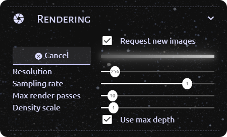

# Volume rendering for CosmoScout VR

A CosmoScout VR plugin which allows rendering of volumetric datasets.


# Configuration

This plugin can be enabled with a configuration using the following pattern in your `settings.json`:

```javascript
{
    ...
    "plugins": {
        ...
        "csp-volume-rendering": {
            "data": {
                "path": <path to directory containing simulation data>,
                "namePattern": <regex pattern that matches simulation filenames>,
                "type": <"vtk"/"netcdf">,
                "structure": <"structured"/"unstructured">,
                "shape": <"cubic"/"spherical">
            },
            "transform": {
                "anchor": <Anchor name, e.g. "Earth">
            }
        }
    }
}
```

The following example settings can be used, if

* Your data is saved in the directory `/path/to/data/`
* The filenames of individual simulation steps follow the pattern `simulation_0.vtk`, `simulation_1.vtk`, `simulation_2.vtk` etc. where `0`, `1`, `2` are indices for the steps
* Your data is saved in a data format readable by vtk
* The layout of your data is a regular structured grid
* All relevant parts of the volume fit into a sphere with a diameter equal to the longest side of the bounding box of the volume

The volume will be placed at the center of the earth scaled to be as big as the earth.
Note that this means that the volume will not be visible, unless

* The planet is (partially) hidden
* The volume is transformed using additional [transform settings](#transform-settings) in the `settings.json`

```javascript
{
    ...
    "plugins": {
        ...
        "csp-volume-rendering": {
            "data": {
                "path": "/path/to/data/",
                "namePattern": "simulation_([0-9]+).vtk",
                "type": "vtk",
                "structure": "structured",
                "shape": "spherical"
            },
            "transform": {
                "anchor": "Earth"
            }
        }
    }
}
```

This configuration only contains the mandatory settings.
All available settings are described in the following sections.
Mandatory settings are shown **bold**, while optional settings are shown in *italics*.
Optional settings will have their default value, if they are not present in the configuration.

As you can see in the example configuration, the settings are grouped in different categories.
The categories have to be inserted as child properties of the `"csp-volume-rendering"` entry, and the individual settings have to be inserted as children of the corresponding category.
There are the following categories:

* [`"data"`](#data-settings)
* [`"rendering"`](#rendering-settings)
* [`"lighting"`](#lighting-settings)
* [`"display"`](#display-settings)
* [`"transform"`](#transform-settings)

## Data settings

| Key | Type | Default | Description |
| --- | --- | --- | --- |
| **volumeDataPath** | string | - | Path to the directory that contains the volumetric data files. |
| **volumeDataPattern** | string | - | Regex pattern that matches the filename of all relevant data files. Has to contain a capture group for marking the timestep and may contain another capture group for marking the level of detail. For more information on the correct format see [Data preparation](#naming-files) |
| **volumeDataType** | `"vtk"` / `"netcdf"` | - | Data format of the specified files. Currently supports VTK data and NetCDF files. |
| **volumeStructure** | `"structured"` / `"structuredSpherical"` / `"unstructured"` | - | Structure of the volumetric data. Currently supports structured regular grids, structured spherical grids and unstructured grids. |
| **volumeShape** | `"cubic"` / `"spherical"` | - | Shape of the volume. By default, spherical volumes are rendered with the same size as the planet they are bound to. Cubic volumes are rendered, so that their corners touch the planets surface. |
| *activeScalar* | string | `""` | Name of the scalar, that should be used for coloring the volume. Has to be prefixed with `"cell_"` or `"point_"`, depending on whether it is a per cell or point scalar. |
| *metadata* | object | `null` | Metadata for the given dataset. See [Metadata](#metadata). |

### Metadata

Some datasets may require metadata to be rendered correctly.
The metadata object includes different parameters depending on the structure of the volume.

#### Structured spherical volume

The parameters `axes` and `ranges` have to be specified for each axis in the grid (radial, latitude, longitude).
The values can be given per axis using the following structure:

```javascript
...
"axes": {
    "lat": 0,
    "lon": 1,
    "radial": 2
}
...
```

If the metadata object is not present in the data settings, the plugin will try to calculate the values automatically.

| Key | Type | Default | Description |
| --- | --- | --- | --- |
| **axes** | int *per axis* | --- | The index of the grid axis in the dataset, that corresponds to the latitudinal/longitudinal/radial axis. |
| **ranges** | double[2] *per axis* | --- | The min and max value of the latitudinal/longitudinal/radial axis in degrees/km. If the first of the two values is smaller than the other, the radial axis will go from the center of the volume to the outside, the longitudinal axis will go from west to east and the latitudinal axis will gro from south to north. To flip the direction of an axis, swap the min and max value. |

## Rendering settings

These settings can also be dynamically changed in the CosmoScout UI.

| Key | Type | Default | Description |
| --- | --- | --- | --- |
| *requestImages* | bool | `true` | When false, no new images of the volumetric data will be rendered. |
| *resolution* | int | `256` | Horizontal and vertical resolution of the rendered images in pixels. |
| *samplingRate* | float | `0.05` | Sampling rate to be used while rendering. Higher values result in higher quality images with less noise. |
| *maxPasses* | int | `10` | Maximum number of additional render passes for progressive rendering. |
| *densityScale* | float | `1` | Sets the density of the volume. |
| *denoiseColor* | bool | `true` | Use the OIDN library to denoise the color image of the volume before displaying it in CosmoScout. |
| *denoiseDepth* | bool | `true` | Use the OIDN library to denoise the image containing depth information of the volume before using it for image based rendering. |
| *depthMode* | `"none"` / `"isosurface"` / `"firstHit"` / `"lastHit"` / `"threshold"` / `"multiThreshold"` | `"none"` | Heuristic for determining per pixel depth values for the rendered images. |
| *transferFunction* | string | `"BlackBody.json` | Name of a exported transfer function file in `<cosmoscout-installation-directory>/share/resources/transferfunctions/` that should be used by default. |

## Lighting settings

These settings can also be dynamically changed in the CosmoScout UI.

| Key | Type | Default | Description |
| --- | --- | --- | --- |
| *enabled* | bool | false | Enables lighting for the rendering. |
| *ambientStrength* | float | `0.5` | Factor for the strength of the ambient light. Only used, when lighting is enabled. |
| *sunStrength* | float | `1` | Factor for the strength of the sunlight. Only used, when lighting is enabled. |

## Display settings

These settings can also be dynamically changed in the CosmoScout UI.

| Key | Type | Default | Description |
| --- | --- | --- | --- |
| *predictiveRendering* | bool | `false` | When true, images will be rendered for a predicted observer perspective instead of the current one. This may result in smaller viewing angles, which improves the quality of the image based rendering. |
| *reuseImages* | bool | `false` | When true, previously rendered images will be cached and may be displayed again, if the viewing angle is suitable. |
| *useDepth* | bool | `true` | When false, depth information on the volume is ignored and not used in the image based rendering. |
| *drawDepth* | bool | `false` | When true, a grayscale image of the depth information will be displayed instead of the color image of the volume. |
| *displayMode* | `"mesh"` / `"points"` | `"mesh"` | Geometry used for displaying rendered images. `"mesh"` uses a continuous triangle mesh for displaying the image, while `"points"` displays the pixels of the image as points of varying size. |

## Transform settings

These settings can only be changed in the settings file.

| Key | Type | Default | Description |
| --- | --- | --- | --- |
| **anchor** | string | - | Name of the SPICE frame, in which the volume should be placed. |
| *position* | double[3] | `[0,0,0]` | Offset from the center of the frame in meters. |
| *scale* | double | `1` | Factor by which the volume should be scaled. A value of `1` results in the volume being scaled to be the same size as the specified anchor. |
| *rotation* | double[3] | `[0,0,0]` | Rotation of the volume as pitch, yaw, roll euler angles in degrees. |


# Data preparation

There are a few aspects to be regarded when preparing your data for use with this plugin.

## Naming files

First of all, your data files have to be named in a specific manner.
Currently, each file may only contain one timestep of the dataset.
A numerical representation of the timestep has to be present at some point in the filename, e.g. "Sim_01.vtk", "Sim_02.vtk" etc.
In the `data.namePattern` configuration property, this numerical representation has to be marked with a regular expression capture group, e.g. `"Sim_([0-9]+).vtk"`.

Optionally you can save timesteps in multiple levels of detail as separate files.
The level of detail has to be represented as a numerical value in the filename with lower values meaning lower levels of detail.
The lod component of the filename has to occur before the timestep component.
In the `data.namePattern` configuration property, this numerical representation has to also be marked with a second regular expression capture group.

## Generating CSV

In addition to the files containing the volume data, a csv file containing scalar values has to be generated and saved in the same directory as the volume data.
Only one file is needed and it will be used for all timesteps.
The file has to be named according to the `data.namePattern` configuration property, with the extension replaced by `.csv`.
It can be created in ParaView by using File->Save Data and selecting "Comma or Tab Delimited Files" for "Files of Type".

This file will be used for filling the parallel coordinates plot with data.
The parallel coordinates plot runs fine with around 100.000 lines, but if your dataset contains more points/cells, you should consider writing only a subset of the data to the csv file.

For NetCDF data files, the python script under [`scripts/metadata.py`](scripts/metadata.py) can be used.
Run it using `python scripts/metadata.py /path/to/datafile.nc` to generate the csv file next to the original file.


# Usage

When CosmoScout VR is started, this plugin will start loading an initial timestep of data specified in the `settings.json` in the background.
Loading the data may take a while depending on its size and data format.
When the data has finished loading, a message will be displayed on the console:


If multiple levels of detail are available, the lowest lod will be loaded first.
Higher lods will be loaded asynchronously when the timestep did not change for 2 seconds.

Afterwards there may be another delay of a few seconds before the first image is rendered.
Rendered images will be displayed at the position specified in the transform settings of the plugin.


If the observer is moved, the image of the volume is updated, so that the volume can be examined from different angles.
The rate at which the updates happen depend on the complexity of the data, the used hardware and the rendering parameters.

## Configuration at runtime

For configuring the plugin at runtime a new tab is added to the CosmoScout sidebar:


### Data

The data section allows selecting the exact data that should be rendered.
The scalar can be selected from a dropdown menu that is filled with values when the data for the initial timestep is loaded.

If multiple timesteps are available, the timestep that should be visualized can be changed using the `Timestep` slider.
The slider is hidden, if only one data file matching `data.namePattern` was found.

In addition to manual timestep selection it is also possible to automatically and uniformly increase the timestep at a speed selectable using the `Animation speed` slider.
The speed is given as indices per second, so starting at timestep `0` and at a speed of `100` after one second data for timestep `100` will be displayed.
The animation can be started and paused using the button at the bottom of the section.


### Rendering

The rendering section contains sliders for setting the rendering parameters resolution, sampling rate, maximume amount of render passes and density scale, that can also be set using properties in the settings.json file.
Information on these settings can be found under [Configuration - Rendering settings](#rendering-settings).

The progressive rendering enabled by setting "Max Passes" to a value greater than `1` will run additional render passes to produce better quality images, as long as no parameters (such as camera perspective or most of the settings configurable in the UI) change.

The section also allows disabling/enabling rendering new images using the checkbox at the top.
When the box is unchecked no new images will be rendered and if there is an ongoing render process it is cancelled and its results are discarded.

Pressing the cancel button will cancel any ongoing render process and start a new one.
The current progress of the rendering progress is shown using the bar next to the cancel button.



### Lighting

The lighting section allows setting the lighting parameters found under [Configuration - Lighting settings](#lighting-settings).

Note that when the lighting is enabled, the relative position of the sun in CosmoScout will be used to calculate the direction of the sunlight.
This means, that you can change this direction by changing the current time using CosmoScout's timeline.

Note, that with enabled lighting you should pause CosmoScout's time if you want to use progressive rendering.
Otherwise, the sun's position will continuously move, which means that no progressive rendering passes can be executed, as the lighting is constantly changing.


### Transfer Function

The transfer function section contains an editor for setting the transfer function that is used for rendering.
The leftmost value of the function will be used for the lowest scalar value present in the dataset, the rightmost will be used for the highest value present.

The transfer function is defined by multiple control points which can be dragged with the mouse.
The y position of each point defines the opacity of the function for the corresponding scalar value.
Between two points the opacity is linearly interpolated.

In addition to the opacity values each point may also define a color value for the corresponding scalar value.
Points that define a color value are shown slightly larger on the graph.
The color function is calculated by interpolating between all control points that do have a color value.

Whether a control point defines a color value can be set using the lock button below the transfer function graph.
If the lock button shows a closed lock, the color of the currently selected control point (larger, brighter outline) can be selected using the button next to the lock button.
It he lock button shows an unlocked lock the control point does not carry any color information.
The state of the lock button can be switched by clicking it.

The current transfer function can be saved to a json file by entering a filename and then clicking the "Export" button.
Previously exported functions can be imported by selecting them from the dropdown at the bottom of the section and then clicking the "Import" button.
Transfer functions are exported to and imported from `<cosmoscout-installation-directory>/share/resources/transferfunctions/`.

To make finetuning of the transfer function easier, you can zoom into the graph using the "X-Range" and "Y-Range" sliders.
When importing a saved transfer function, all control points will be placed relative to the current x-range.
This enables you to focus your transfer function on smaller ranges of the whole data extent.


### Parallel Coordinates

The parallel coordinates tab allows to use a parallel coordinates plot to limit the visible parts of the volume.

Along each axis, min and max values can be specified, either by clicking and dragging on the axis or by selecting an axis by clicking on it and then changing min and max values in the corresponding text fields.
Brushed axes can be reset by clicking on them outside the brushed area.

Axes can be reordered by dragging and dropping them at their header.

The current state can be saved to a json file by entering a filename and then clicking the "Export" button.
Previously exported states can be imported by selecting them from the dropdown at the bottom of the section and then clicking the "Import" button.
States are exported to and imported from `<cosmoscout-installation-directory>/share/resources/parcoords/`.


Using the button in the top right of the plot, the parallel coordinates plot can be moved to a draggable and resizable window, which allows a better overview of the plot.
You can move the plot back to the sidebar by closing the window.
    


### Display

The display section allows changing the way rendered images are displayed in CosmoScout VR.

In `mesh` mode the images will be displayed on one continuous mesh.
This prevents holes in the volume when viewed from the side but may result in "smeared" images for some transfer functions.

In `points` mode the pixels of the displayed image are rendered as points of varying size.
This may result in visible grid patterns and holes in the volume when viewed from the side.

Mesh mode | Points mode
:--: | :--:
 | 


### Depth

The depth section allows configurating the image based rendering.

If the first checkbox "Use depth data" is enabled, depth information that was collected during rendering is used for warping the image for viewing it from novel perspectives.
If it is disabled, the image will be displayed as a flat image.

The second checkbox allows rendering the collected depth information as a grayscale image instead of the color image.
Areas that are shown in darker colors are closer to the camera, while brighter areas are further from the camera.

The radio buttons at the bottom of the section allow selecting the heuristic, that should be used for gathering depth information on the volume. The recommended setting for most cases is "Multiple opacity thresholds".


### Denoising

The plugin optionally uses Intel Open Image Denoise (OIDN) for denoising both the rendered color images, as well as the depth information.
This can be enabled/disabled in this section for both images seperately.


### Latency compensation

The latency compensation section contains toggles for features to reduce the effects of the rendering latency.

Predictive rendering aims to render images not for the current camera perspective, but for the perspective, that the camera may have when the image has finished rendering.
This is most effective when the camera is constantly moved at a steady pace.

Reuse images enables displaying previously rendered images, if those are a better fit for the current perspective than the latest rendered image.
Only images rendered with the same parameters will be considered for reuse.


# Optional features

Some optional features can be activated by inserting an additional settings category into the configuration file.
These features will only be active and use their default settings, if their category is present in the configuration file.
Currently there are the following optional features:

* [`"core"`](#core-rendering): Render a spherical core inside the volume
* [`"pathlines"`](#pathline-rendering): Render pathlines inside the volume

## Core rendering

Used to render a spherical core inside the volume.

One of the volume's scalars may be used to color the core.
For this, the volume will be sampled at the surface of the core, so make sure, that the core's radius is slightly larger than the inner radius of the volume.

### Settings

These settings can only be changed in the settings file.
They have to be children of the `"core"` category in the plugin configuration.

| Key | Type | Default | Description |
| --- | --- | --- | --- |
| *enabled* | bool | `true` | Enables the rendering of the core. |
| *scalar* | string | `""` | If this scalar is part of the volume data, the core will be colored in grayscale according to the scalar. Otherwise the core will be light gray. Has to be prefixed with `"cell_"` or `"point_"`, depending on whether it is a per cell or point scalar. |
| **radius** | float | - | Sets the radius of the core in the same units as used by the volume. |

## Pathline rendering

Used to render precomputed pathlines inside the volume.

### Settings

All settings apart from the path can be dynamically changed in the CosmoScout UI.
They have to be children of the `"pathlines"` category in the plugin configuration.

| Key | Type | Default | Description |
| --- | --- | --- | --- |
| *enabled* | bool | `true` | Enables the rendering of the pathlines. |
| **path** | string | - | Path to a vtk data file containing the pathlines. |
| *lineSize* | float | `1` | Width of the pathlines in the same units as used by the volume. |

### Supported data

Currently, only files in the legacy VTK format (.vtk) are supported.
The dataset should be of the type `vtkPolyData` with cells of the type `vtkPolyLine`.

The dataset **has to** include a point scalar named `"ParticleAge"`, which will be used to color the pathlines from blue at their starting point over white to red at their end point.

Apart from the .vtk file, you also **have to** supply a .csv file containing the cell scalar values of the pathlines.
This will be used to allow restricting the rendered pathlines using a parallel coordinates plot.

Scalars with the names `<name>_start` and `<name>_end` will be linked to a corresponding scalar `<name>` in the volume data, if such a scalar exists.
If a cell scalar named `"InjectionStepId_start"` is present, it will be used to get the starting time of the pathlines.

### Usage

The pathlines section in the sidebar can be used to configure the rendering of the pathlines.
The "Render pathlines" checkbox can be used to activate or deactivate the rendering of the pathlines and the "Line size" slider can be used to set the width of the rendered lines (in the same units as used by the volume).

By default, the pathlines are also affected by the configuration in the [Parallel Coordinates](#parallel-coordinates) tab.
Restrictions on scalars of the volume data will be applied to linked (as described under [Supported data](#supported-data)) scalars of the pathline data.
Additionally, if a scalar for getting the starting time of each pathline is available (see [Supported data](#supported-data)), it will automatically be restricted to the current timestep set in the [Data](#data) tab and 9 previous timesteps.


If this linking with the parallel coordinates plot for the volume data is not wanted, it can be deactivated by checking the "Separate parallel coordinates" checkbox.
Doing so will add another parallel coordinates plot containing the pathline scalars to the "Pathlines" tab, which can be used to restrict the shown pathlines.
To manually transfer the volume's parallel coordinate plot configuration to this one, you can use the "Copy to pathlines" button at the bottom of the "Parallel Coordinates" tab.


